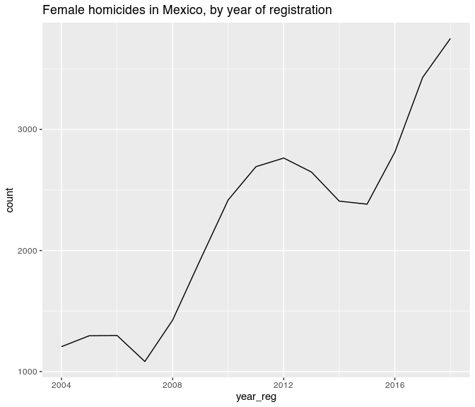
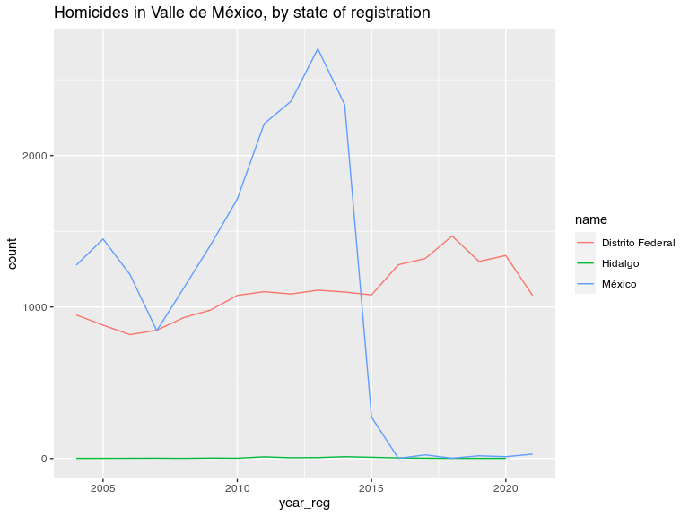
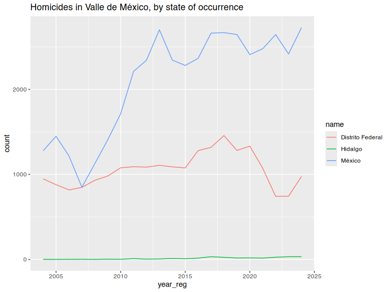

Injury Intent Deaths 2004-2024 in Mexico
================
Diego Valle-Jones
January 05, 2024

- [Injury Intent Deaths 2004-2024 in
  Mexico](#injury-intent-deaths-2004-2024-in-mexico)
  - [What does it do?](#what-does-it-do)
  - [Installation](#installation)
  - [Examples](#examples)
  - [Warning](#warning)
  - [License](#license)

# Injury Intent Deaths 2004-2024 in Mexico

|              |                                                 |
|--------------|-------------------------------------------------|
| **Author:**  | Diego Valle-Jones                               |
| **License:** | [MIT](http://en.wikipedia.org/wiki/MIT_License) |
| **Website:** | <https://github.com/diegovalle/mxmortalitydb>   |

## What does it do?

This is a data only package containing all injury intent deaths
(accidents, suicides, homicides, legal interventions, and deaths of
unspecified intent) registered by the SSA/INEGI from 2004 to 2024. The
data source for the database is the
[INEGI](http://www.inegi.org.mx/est/contenidos/proyectos/registros/vitales/mortalidad/default.aspx).
In addition the data was coded with the Injury Mortality Matrix provided
by the [CDC](http://www.cdc.gov/nchs/data/ice/icd10_transcode.pdf). The
code used to clean the database is available [as a separate
program](https://github.com/diegovalle/death.index)

## Installation

For the moment this package is only available from github. For the
development version:

``` r
if (!require(devtools)) {
    install.packages("devtools")
}
devtools::install_github('diegovalle/mxmortalitydb')
```

``` r
library(mxmortalitydb)
library(ggplot2)
suppressPackageStartupMessages(library(dplyr))
```

## Examples

Deaths by homicide in Mexico

``` r
injury.intent %>%
  filter(intent == "Homicide") %>%
  group_by(year_reg, intent) %>%
  summarise(count = n())
```

    ## `summarise()` has grouped output by 'year_reg'. You can override using the
    ## `.groups` argument.

    ## # A tibble: 21 × 3
    ## # Groups:   year_reg [21]
    ##    year_reg intent   count
    ##       <int> <fct>    <int>
    ##  1     2004 Homicide  9330
    ##  2     2005 Homicide  9926
    ##  3     2006 Homicide 10454
    ##  4     2007 Homicide  8868
    ##  5     2008 Homicide 14007
    ##  6     2009 Homicide 19804
    ##  7     2010 Homicide 25757
    ##  8     2011 Homicide 27213
    ##  9     2012 Homicide 25967
    ## 10     2013 Homicide 23063
    ## # ℹ 11 more rows

All deaths of unknown intent in Sinaloa (state code 25) where the injury
mechanism was a firearm, by year of registration:

``` r
## The main data.frame in the package is called injury.intent
injury.intent %>%
  filter(is.na(intent)  & 
           mechanism == "Firearm" & 
           state_reg == 25 ) %>%
  group_by(year_reg, intent) %>%
  summarise(count = n())
```

    ## `summarise()` has grouped output by 'year_reg'. You can override using the
    ## `.groups` argument.

    ## # A tibble: 18 × 3
    ## # Groups:   year_reg [18]
    ##    year_reg intent count
    ##       <int> <fct>  <int>
    ##  1     2004 <NA>      11
    ##  2     2005 <NA>      11
    ##  3     2006 <NA>       2
    ##  4     2009 <NA>       8
    ##  5     2010 <NA>       7
    ##  6     2011 <NA>      25
    ##  7     2012 <NA>     197
    ##  8     2013 <NA>       8
    ##  9     2014 <NA>       1
    ## 10     2015 <NA>       1
    ## 11     2016 <NA>       3
    ## 12     2017 <NA>       1
    ## 13     2019 <NA>       2
    ## 14     2020 <NA>       2
    ## 15     2021 <NA>      20
    ## 16     2022 <NA>       4
    ## 17     2023 <NA>       2
    ## 18     2024 <NA>       9

In addition to the injury.intent data.frame several other datasets are
available:

- **aggressor.relation.code** (relationship between the aggressor and
  his victim, useful for merging aggressor_relationship_code, Spanish)
- **geo.codes** (names of states and municipios, useful for merging
  state_reg, state_occur_death and mun_reg, mun_occur_death codes)
- **icd.103** (list of 103 deceases by the WHO, Spanish)
- **metro.areas** (2010 metro areas as defined by the CONAPO along with
  2010 population counts)
- **big.municipios** (since metro areas are not statistical in nature
  this is a list of all municipios which are bigger than the smallest
  metro area but are not part of one)
- **mex.list.group** (groups of deceases, Spanish)
- **mex.list** (list of deceases, Spanish)

Homicides merged with the aggressor.relation.code table:

``` r
df <- injury.intent %>%
  filter(intent == "Homicide") %>%
  group_by(year_reg, aggressor_relation_code) %>%
  summarise(count = n())
```

    ## `summarise()` has grouped output by 'year_reg'. You can override using the
    ## `.groups` argument.

``` r
## A couple of other tables are included in the package to
## interpret some of the values in injury.intent
merge(df, aggressor.relation.code)
```

    ##     aggressor_relation_code year_reg count         relationship
    ## 1                         1     2012    25                Padre
    ## 2                         1     2017     7                Padre
    ## 3                         1     2016    13                Padre
    ## 4                         1     2021     4                Padre
    ## 5                         1     2018     6                Padre
    ## 6                         1     2014   107                Padre
    ## 7                         1     2015     7                Padre
    ## 8                         1     2024     2                Padre
    ## 9                         1     2020     6                Padre
    ## 10                        1     2023    10                Padre
    ## 11                        1     2013    18                Padre
    ## 12                        1     2022     9                Padre
    ## 13                        1     2019     4                Padre
    ## 14                        2     2021     4                Madre
    ## 15                        2     2024     3                Madre
    ## 16                        2     2015    11                Madre
    ## 17                        2     2016     9                Madre
    ## 18                        2     2012    64                Madre
    ## 19                        2     2017     2                Madre
    ## 20                        2     2014    16                Madre
    ## 21                        2     2022     5                Madre
    ## 22                        2     2019     6                Madre
    ## 23                        2     2023     3                Madre
    ## 24                        2     2013    17                Madre
    ## 25                        2     2020     1                Madre
    ## 26                        2     2018     8                Madre
    ## 27                        3     2013    16              Hermano
    ## 28                        3     2017    13              Hermano
    ## 29                        3     2024     5              Hermano
    ## 30                        3     2014    13              Hermano
    ## 31                        3     2012    14              Hermano
    ## 32                        3     2015     9              Hermano
    ## 33                        3     2022    14              Hermano
    ## 34                        3     2021     7              Hermano
    ## 35                        3     2023    15              Hermano
    ## 36                        3     2020     4              Hermano
    ## 37                        3     2019     5              Hermano
    ## 38                        3     2018    14              Hermano
    ## 39                        3     2016    11              Hermano
    ## 40                        4     2012     7              Hermana
    ## 41                        4     2017     5              Hermana
    ## 42                        4     2013     6              Hermana
    ## 43                        4     2018     4              Hermana
    ## 44                        4     2024     1              Hermana
    ## 45                        4     2016     4              Hermana
    ## 46                        4     2014     9              Hermana
    ## 47                        4     2015     2              Hermana
    ## 48                        4     2021     5              Hermana
    ## 49                        4     2022     2              Hermana
    ## 50                        4     2019     4              Hermana
    ## 51                        5     2017     9                 Hijo
    ## 52                        5     2019     7                 Hijo
    ## 53                        5     2012    10                 Hijo
    ## 54                        5     2021    16                 Hijo
    ## 55                        5     2020     5                 Hijo
    ## 56                        5     2018    11                 Hijo
    ## 57                        5     2016    13                 Hijo
    ## 58                        5     2013    14                 Hijo
    ## 59                        5     2014    20                 Hijo
    ## 60                        5     2023     9                 Hijo
    ## 61                        5     2015    10                 Hijo
    ## 62                        5     2024     9                 Hijo
    ## 63                        5     2022    11                 Hijo
    ## 64                        6     2013     2                 Hija
    ## 65                        6     2015     1                 Hija
    ## 66                        6     2024     2                 Hija
    ## 67                        6     2012     1                 Hija
    ## 68                        6     2014     2                 Hija
    ## 69                        6     2019     1                 Hija
    ## 70                        6     2022     1                 Hija
    ## 71                        6     2016     3                 Hija
    ## 72                        6     2018     2                 Hija
    ## 73                        7     2019     1               Abuelo
    ## 74                        7     2014     2               Abuelo
    ## 75                        7     2013     4               Abuelo
    ## 76                        7     2012     5               Abuelo
    ## 77                        7     2015     1               Abuelo
    ## 78                        7     2016     1               Abuelo
    ## 79                        8     2013     5               Abuela
    ## 80                        8     2012     3               Abuela
    ## 81                        8     2014     8               Abuela
    ## 82                        8     2022     3               Abuela
    ## 83                        8     2016     1               Abuela
    ## 84                        9     2021     3                Nieto
    ## 85                        9     2013    29                Nieto
    ## 86                        9     2012     5                Nieto
    ## 87                        9     2024     5                Nieto
    ## 88                        9     2017     3                Nieto
    ## 89                        9     2018     1                Nieto
    ## 90                        9     2019     2                Nieto
    ## 91                        9     2016     4                Nieto
    ## 92                        9     2014    19                Nieto
    ## 93                        9     2022     2                Nieto
    ## 94                        9     2015     3                Nieto
    ## 95                       10     2012     1                Nieta
    ## 96                       10     2013     2                Nieta
    ## 97                       10     2019     1                Nieta
    ## 98                       10     2014     1                Nieta
    ## 99                       11     2017     9      Esposo, Cónyuge
    ## 100                      11     2019     7      Esposo, Cónyuge
    ## 101                      11     2014    22      Esposo, Cónyuge
    ## 102                      11     2021     9      Esposo, Cónyuge
    ## 103                      11     2013    29      Esposo, Cónyuge
    ## 104                      11     2022    17      Esposo, Cónyuge
    ## 105                      11     2023     8      Esposo, Cónyuge
    ## 106                      11     2024     6      Esposo, Cónyuge
    ## 107                      11     2012    27      Esposo, Cónyuge
    ## 108                      11     2015    30      Esposo, Cónyuge
    ## 109                      11     2016    24      Esposo, Cónyuge
    ## 110                      11     2018    15      Esposo, Cónyuge
    ## 111                      11     2020     9      Esposo, Cónyuge
    ## 112                      12     2013     9      Esposa, Cónyuge
    ## 113                      12     2019    16      Esposa, Cónyuge
    ## 114                      12     2022    14      Esposa, Cónyuge
    ## 115                      12     2021    26      Esposa, Cónyuge
    ## 116                      12     2012     3      Esposa, Cónyuge
    ## 117                      12     2015     2      Esposa, Cónyuge
    ## 118                      12     2020     8      Esposa, Cónyuge
    ## 119                      12     2014    10      Esposa, Cónyuge
    ## 120                      12     2024     3      Esposa, Cónyuge
    ## 121                      12     2023     1      Esposa, Cónyuge
    ## 122                      12     2017     2      Esposa, Cónyuge
    ## 123                      12     2016     4      Esposa, Cónyuge
    ## 124                      12     2018     5      Esposa, Cónyuge
    ## 125                      13     2013     9                  Tío
    ## 126                      13     2019     2                  Tío
    ## 127                      13     2017     6                  Tío
    ## 128                      13     2016    13                  Tío
    ## 129                      13     2012     7                  Tío
    ## 130                      13     2022     2                  Tío
    ## 131                      13     2015     8                  Tío
    ## 132                      13     2014     6                  Tío
    ## 133                      13     2023     1                  Tío
    ## 134                      13     2024     1                  Tío
    ## 135                      13     2018     2                  Tío
    ## 136                      14     2018     1                  Tía
    ## 137                      14     2012     1                  Tía
    ## 138                      15     2021     6              Sobrino
    ## 139                      15     2015     9              Sobrino
    ## 140                      15     2019     5              Sobrino
    ## 141                      15     2014    10              Sobrino
    ## 142                      15     2016     4              Sobrino
    ## 143                      15     2013    14              Sobrino
    ## 144                      15     2018     4              Sobrino
    ## 145                      15     2017     9              Sobrino
    ## 146                      15     2022     6              Sobrino
    ## 147                      15     2024     5              Sobrino
    ## 148                      15     2023     6              Sobrino
    ## 149                      15     2012    19              Sobrino
    ## 150                      16     2016     1              Sobrina
    ## 151                      16     2023     1              Sobrina
    ## 152                      17     2022     4                Primo
    ## 153                      17     2017    13                Primo
    ## 154                      17     2012    14                Primo
    ## 155                      17     2013    15                Primo
    ## 156                      17     2023     2                Primo
    ## 157                      17     2015    11                Primo
    ## 158                      17     2021     2                Primo
    ## 159                      17     2018    10                Primo
    ## 160                      17     2016     9                Primo
    ## 161                      17     2019     3                Primo
    ## 162                      17     2014    10                Primo
    ## 163                      17     2024     4                Primo
    ## 164                      17     2020     4                Primo
    ## 165                      18     2016     1                Prima
    ## 166                      21     2012     1             Bisnieto
    ## 167                      27     2012     2               Suegro
    ## 168                      27     2015     2               Suegro
    ## 169                      27     2013     1               Suegro
    ## 170                      27     2018     3               Suegro
    ## 171                      27     2017     2               Suegro
    ## 172                      27     2016     1               Suegro
    ## 173                      31     2018     3                Yerno
    ## 174                      31     2015     4                Yerno
    ## 175                      31     2013     5                Yerno
    ## 176                      31     2023     1                Yerno
    ## 177                      31     2022     1                Yerno
    ## 178                      31     2017     4                Yerno
    ## 179                      31     2021     1                Yerno
    ## 180                      31     2014     1                Yerno
    ## 181                      31     2012     4                Yerno
    ## 182                      31     2016     3                Yerno
    ## 183                      31     2024     1                Yerno
    ## 184                      32     2018     1                Nuera
    ## 185                      33     2023     3               Cuñado
    ## 186                      33     2017     6               Cuñado
    ## 187                      33     2018     7               Cuñado
    ## 188                      33     2015     9               Cuñado
    ## 189                      33     2013     8               Cuñado
    ## 190                      33     2022     4               Cuñado
    ## 191                      33     2014     9               Cuñado
    ## 192                      33     2012     9               Cuñado
    ## 193                      33     2021     1               Cuñado
    ## 194                      33     2016     3               Cuñado
    ## 195                      33     2024     4               Cuñado
    ## 196                      33     2019     1               Cuñado
    ## 197                      34     2012     1               Cuñada
    ## 198                      34     2022     1               Cuñada
    ## 199                      35     2014     2              Concuño
    ## 200                      35     2017     2              Concuño
    ## 201                      35     2013     1              Concuño
    ## 202                      35     2012     1              Concuño
    ## 203                      37     2012     6            Padrastro
    ## 204                      37     2017     2            Padrastro
    ## 205                      37     2019     1            Padrastro
    ## 206                      37     2018     2            Padrastro
    ## 207                      37     2020     2            Padrastro
    ## 208                      37     2015     6            Padrastro
    ## 209                      37     2016     6            Padrastro
    ## 210                      37     2024     2            Padrastro
    ## 211                      37     2013     7            Padrastro
    ## 212                      37     2021     2            Padrastro
    ## 213                      37     2014     2            Padrastro
    ## 214                      37     2022     5            Padrastro
    ## 215                      37     2023     2            Padrastro
    ## 216                      38     2013     1            Madrastra
    ## 217                      39     2013     2             Hijastro
    ## 218                      39     2016     1             Hijastro
    ## 219                      39     2012     2             Hijastro
    ## 220                      39     2015     2             Hijastro
    ## 221                      39     2021     1             Hijastro
    ## 222                      39     2017     1             Hijastro
    ## 223                      39     2014     1             Hijastro
    ## 224                      41     2018     1          Hermanastro
    ## 225                      41     2013     3          Hermanastro
    ## 226                      41     2014     1          Hermanastro
    ## 227                      41     2012     1          Hermanastro
    ## 228                      41     2020     1          Hermanastro
    ## 229                      45     2020     7 Concubino, compañero
    ## 230                      45     2023    16 Concubino, compañero
    ## 231                      45     2014    26 Concubino, compañero
    ## 232                      45     2017    21 Concubino, compañero
    ## 233                      45     2018    10 Concubino, compañero
    ## 234                      45     2016    25 Concubino, compañero
    ## 235                      45     2013    27 Concubino, compañero
    ## 236                      45     2019     5 Concubino, compañero
    ## 237                      45     2021     8 Concubino, compañero
    ## 238                      45     2024     7 Concubino, compañero
    ## 239                      45     2012     9 Concubino, compañero
    ## 240                      45     2022    15 Concubino, compañero
    ## 241                      45     2015    28 Concubino, compañero
    ## 242                      46     2016     6 Concubina, compañera
    ## 243                      46     2021     1 Concubina, compañera
    ## 244                      46     2017     4 Concubina, compañera
    ## 245                      46     2012     4 Concubina, compañera
    ## 246                      46     2013     4 Concubina, compañera
    ## 247                      46     2022     1 Concubina, compañera
    ## 248                      46     2015     5 Concubina, compañera
    ## 249                      46     2014     7 Concubina, compañera
    ## 250                      46     2023     2 Concubina, compañera
    ##  [ reached 'max' / getOption("max.print") -- omitted 132 rows ]

A plot of female homicide counts (making sure to exclude those that
occurred outside Mexico):

``` r
## make sure to only count deaths that occurred inside Mexico (codes 33 to 35 are USA, LATAM and Other)
df <- injury.intent %>%
  filter(sex == "Female" & 
           intent == "Homicide" & 
           !state_occur_death %in% 33:35) %>%
  group_by(year_reg, intent) %>%
  summarise(count = n())
```

    ## `summarise()` has grouped output by 'year_reg'. You can override using the
    ## `.groups` argument.

``` r
ggplot(df, aes(year_reg, count)) +
  geom_line() +
  labs(title = "Female homicides in Mexico, by year of registration")
```

<!-- -->

Homicides in the Mexico City metro area (ZM Valle de México), by the
state where the murder was *registered*

``` r
plotMetro <- function(metro.name) {
  require(stringr)
  ## data.frame metro.areas contains the 2010 CONAPO metro areas
  df <- merge(injury.intent, 
              metro.areas, 
              by.x = c('state_reg', 'mun_reg'), 
              by.y=c('state_code', 'mun_code'))
  ## Homicides in Mexico City, by state of registratio
  df2 <- df %>%
    filter(metro_area == metro.name & 
             intent == "Homicide") %>%
    group_by(state_reg, year_reg) %>%
    summarise(count = n())
  ## data.frame geo.codes contains the names of Mexican states (with mun_code 0) and municipios
  df2 <- merge(df2, subset(geo.codes, mun_code ==0), by.x = 'state_reg', by.y = 'state_code')
  ggplot(df2, aes(year_reg, count, group = state_reg, color = name)) +
    geom_line() +
    labs(title = str_c("Homicides in ", metro.name, ", by state of registration"))
  }
plotMetro("Valle de México")
```

    ## Loading required package: stringr

    ## `summarise()` has grouped output by 'state_reg'. You can override using the
    ## `.groups` argument.

<!-- -->

The drop in homicides in the State of Mexico looks weird, let’s plot by
where the murder *occurred*

``` r
plotMetro_occur <- function(metro.name) {
  require(stringr)
  ## data.frame metro.areas contains the 2010 CONAPO metro areas
  df <- merge(injury.intent, 
              metro.areas, 
              by.x = c('state_occur_death', 'mun_occur_death'), 
              by.y=c('state_code', 'mun_code'))
  ## Homicides in Mexico City, by state of registratio
  df2 <- df %>%
    filter(metro_area == metro.name & 
             intent == "Homicide") %>%
    group_by(state_occur_death, year_reg) %>%
    summarise(count = n())
  ## data.frame geo.codes contains the names of Mexican states (with mun_code 0) and municipios
  df2 <- merge(df2, subset(geo.codes, mun_code ==0), by.x = 'state_occur_death', by.y = 'state_code')
  ggplot(df2, aes(year_reg, count, group = state_occur_death, color = name)) +
    geom_line() +
    labs(title = str_c("Homicides in ", metro.name, ", by state of occurrence"))
  }
plotMetro_occur("Valle de México")
```

    ## `summarise()` has grouped output by 'state_occur_death'. You can override using
    ## the `.groups` argument.

<!-- -->

So something changed in the way homicides were registered in the State
of Mexico and you have to make sure to plot by where the homicide
occurred.

## Warning

I encourage you to get acquainted with the database since it may contain
some errors (introduced at the source) and some fields may be difficult
to interpret because of the large number of missing values (see the
aggressor relation example). The field *intent.imputed* is the result of
running a statistical model to impute the intent of deaths of unknown
intent, and is mainly useful to the author of this package. Feel free to
ignore the column.

Total Imputed Homicides in Mexico:

``` r
## make sure to only count deaths that occurred inside Mexico (codes 33 to 35 are USA, LATAM and Other)
injury.intent %>%
  filter(intent.imputed == "Homicide" & !state_occur_death %in% 33:35) %>%
  group_by(year_reg) %>%
  summarise(count = n())
```

    ## # A tibble: 21 × 2
    ##    year_reg count
    ##       <int> <int>
    ##  1     2004 10474
    ##  2     2005 11015
    ##  3     2006 11452
    ##  4     2007 10229
    ##  5     2008 15211
    ##  6     2009 21145
    ##  7     2010 27527
    ##  8     2011 30134
    ##  9     2012 27954
    ## 10     2013 24849
    ## # ℹ 11 more rows

## License

This package is free and open source software, licensed
[MIT](http://en.wikipedia.org/wiki/MIT_License).
