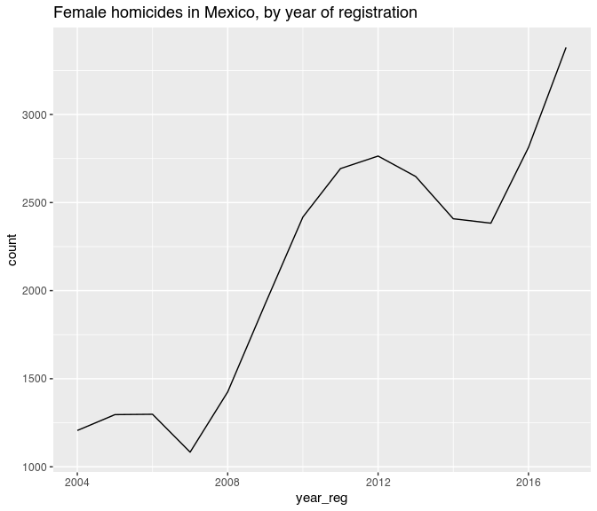
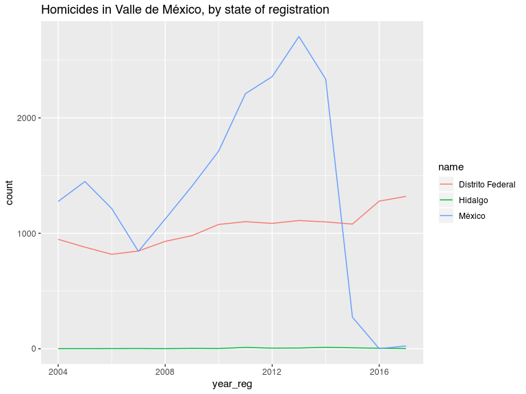

Injury Intent Deaths 2004-2016 in Mexico
================
Diego Valle-Jones
January 05, 2018

-   [Injury Intent Deaths 2004-2016 in Mexico](#injury-intent-deaths-2004-2016-in-mexico)
    -   [What does it do?](#what-does-it-do)
    -   [Installation](#installation)
    -   [Examples](#examples)
    -   [Warning](#warning)
    -   [License](#license)

Injury Intent Deaths 2004-2016 in Mexico
========================================

[](https://travis-ci.org/diegovalle/mxmortalitydb)

|              |                                                 |
|--------------|-------------------------------------------------|
| **Author:**  | Diego Valle-Jones                               |
| **License:** | [MIT](http://en.wikipedia.org/wiki/MIT_License) |
| **Website:** | <https://github.com/diegovalle/mxmortalitydb>   |

What does it do?
----------------

This is a data only package containing all injury intent deaths (accidents, suicides, homicides, legal interventions, and deaths of unspecified intent) registered by the SSA/INEGI from 2004 to 2016. The data source for the database is the [INEGI](http://www.inegi.org.mx/est/contenidos/proyectos/registros/vitales/mortalidad/default.aspx). In addition the data was coded with the Injury Mortality Matrix provided by the [CDC](http://www.cdc.gov/nchs/data/ice/icd10_transcode.pdf). The code used to clean the database is available [as a separate program](https://github.com/diegovalle/death.index)

Installation
------------

For the moment this package is only available from github. For the development version:

``` r
if (!require(devtools)) {
    install.packages("devtools")
}
devtools::install_github('diegovalle/mxmortalitydb')
```

``` r
library(mxmortalitydb)
library(ggplot2)
library(dplyr)
```

    ## 
    ## Attaching package: 'dplyr'

    ## The following objects are masked from 'package:stats':
    ## 
    ##     filter, lag

    ## The following objects are masked from 'package:base':
    ## 
    ##     intersect, setdiff, setequal, union

Examples
--------

All deaths of unknown intent in Sinaloa (state code 25) where the injury mechanism was a firearm, by year of registration:

``` r
## The main data.frame in the package is called injury.intent
injury.intent %>%
  filter(is.na(intent)  & 
           mechanism == "Firearm" & 
           state_reg == 25 ) %>%
  group_by(year_reg, intent) %>%
  summarise(count = n())
```

    ## # A tibble: 11 x 3
    ## # Groups:   year_reg [?]
    ##    year_reg intent count
    ##       <int> <fctr> <int>
    ##  1     2004   <NA>    11
    ##  2     2005   <NA>    11
    ##  3     2006   <NA>     2
    ##  4     2009   <NA>     8
    ##  5     2010   <NA>     7
    ##  6     2011   <NA>    25
    ##  7     2012   <NA>   197
    ##  8     2013   <NA>     8
    ##  9     2014   <NA>     1
    ## 10     2015   <NA>     1
    ## 11     2016   <NA>     3

In addition to the injury.intent data.frame several other datasets are available:

-   **aggressor.relation.code** (relationship between the aggressor and his victim, useful for merging aggressor\_relationship\_code, Spanish)
-   **geo.codes** (names of states and municipios, useful for merging state\_reg, state\_occur\_death and mun\_reg, mun\_occur\_death codes)
-   **icd.103** (list of 103 deceases by the WHO, Spanish)
-   **metro.areas** (2010 metro areas as defined by the CONAPO along with 2010 population counts)
-   **big.municipios** (since metro areas are not statistical in nature this is a list of all municipios which are bigger than the smallest metro area but are not part of one)
-   **mex.list.group** (groups of deceases, Spanish)
-   **mex.list** (list of deceases, Spanish)

Homicides merged with the aggressor.relation.code table:

``` r
df <- injury.intent %>%
  filter(intent == "Homicide") %>%
  group_by(year_reg, aggressor_relation_code) %>%
  summarise(count = n())
## A couple of other tables are included in the package to
## interpret some of the values in injury.intent
merge(df, aggressor.relation.code)
```

    ##     aggressor_relation_code year_reg count            relationship
    ## 1                         1     2012    25                   Padre
    ## 2                         1     2015     7                   Padre
    ## 3                         1     2016    13                   Padre
    ## 4                         1     2014   107                   Padre
    ## 5                         1     2013    18                   Padre
    ## 6                         2     2015    11                   Madre
    ## 7                         2     2016     9                   Madre
    ## 8                         2     2014    16                   Madre
    ## 9                         2     2013    17                   Madre
    ## 10                        2     2012    64                   Madre
    ## 11                        3     2015     9                 Hermano
    ## 12                        3     2014    13                 Hermano
    ## 13                        3     2013    16                 Hermano
    ## 14                        3     2012    14                 Hermano
    ## 15                        3     2016    11                 Hermano
    ## 16                        4     2015     2                 Hermana
    ## 17                        4     2012     7                 Hermana
    ## 18                        4     2013     6                 Hermana
    ## 19                        4     2014     9                 Hermana
    ## 20                        4     2016     4                 Hermana
    ## 21                        5     2012    10                    Hijo
    ## 22                        5     2013    14                    Hijo
    ## 23                        5     2015    10                    Hijo
    ## 24                        5     2016    13                    Hijo
    ## 25                        5     2014    20                    Hijo
    ## 26                        6     2012     1                    Hija
    ## 27                        6     2016     3                    Hija
    ## 28                        6     2013     2                    Hija
    ## 29                        6     2015     1                    Hija
    ## 30                        6     2014     2                    Hija
    ## 31                        7     2016     1                  Abuelo
    ## 32                        7     2015     1                  Abuelo
    ## 33                        7     2012     5                  Abuelo
    ## 34                        7     2013     4                  Abuelo
    ## 35                        7     2014     2                  Abuelo
    ## 36                        8     2014     8                  Abuela
    ## 37                        8     2012     3                  Abuela
    ## 38                        8     2013     5                  Abuela
    ## 39                        8     2016     1                  Abuela
    ## 40                        9     2013    29                   Nieto
    ## 41                        9     2015     3                   Nieto
    ## 42                        9     2014    19                   Nieto
    ## 43                        9     2016     4                   Nieto
    ## 44                        9     2012     5                   Nieto
    ## 45                       10     2013     2                   Nieta
    ## 46                       10     2012     1                   Nieta
    ## 47                       10     2014     1                   Nieta
    ## 48                       11     2012    27         Esposo, Cónyuge
    ## 49                       11     2016    24         Esposo, Cónyuge
    ## 50                       11     2013    29         Esposo, Cónyuge
    ## 51                       11     2014    22         Esposo, Cónyuge
    ## 52                       11     2015    30         Esposo, Cónyuge
    ## 53                       12     2016     4         Esposa, Cónyuge
    ## 54                       12     2014    10         Esposa, Cónyuge
    ## 55                       12     2015     2         Esposa, Cónyuge
    ## 56                       12     2012     3         Esposa, Cónyuge
    ## 57                       12     2013     9         Esposa, Cónyuge
    ## 58                       13     2014     6                     Tío
    ## 59                       13     2015     8                     Tío
    ## 60                       13     2013     9                     Tío
    ## 61                       13     2012     7                     Tío
    ## 62                       13     2016    13                     Tío
    ## 63                       14     2012     1                     Tía
    ## 64                       15     2012    19                 Sobrino
    ## 65                       15     2015     9                 Sobrino
    ## 66                       15     2014    10                 Sobrino
    ## 67                       15     2013    14                 Sobrino
    ## 68                       15     2016     4                 Sobrino
    ## 69                       16     2016     1                 Sobrina
    ## 70                       17     2013    15                   Primo
    ## 71                       17     2012    14                   Primo
    ## 72                       17     2015    11                   Primo
    ## 73                       17     2014    10                   Primo
    ## 74                       17     2016     9                   Primo
    ## 75                       18     2016     1                   Prima
    ## 76                       21     2012     1                Bisnieto
    ## 77                       27     2016     1                  Suegro
    ## 78                       27     2015     2                  Suegro
    ## 79                       27     2012     2                  Suegro
    ## 80                       27     2013     1                  Suegro
    ## 81                       31     2012     4                   Yerno
    ## 82                       31     2014     1                   Yerno
    ## 83                       31     2016     3                   Yerno
    ## 84                       31     2015     4                   Yerno
    ## 85                       31     2013     5                   Yerno
    ## 86                       33     2015     9                  Cuñado
    ## 87                       33     2013     8                  Cuñado
    ## 88                       33     2012     9                  Cuñado
    ## 89                       33     2014     9                  Cuñado
    ## 90                       33     2016     3                  Cuñado
    ## 91                       34     2012     1                  Cuñada
    ## 92                       35     2014     2                 Concuño
    ## 93                       35     2012     1                 Concuño
    ## 94                       35     2013     1                 Concuño
    ## 95                       37     2015     6               Padrastro
    ## 96                       37     2012     6               Padrastro
    ## 97                       37     2016     6               Padrastro
    ## 98                       37     2014     2               Padrastro
    ## 99                       37     2013     7               Padrastro
    ## 100                      38     2013     1               Madrastra
    ## 101                      39     2013     2                Hijastro
    ## 102                      39     2012     2                Hijastro
    ## 103                      39     2016     1                Hijastro
    ## 104                      39     2014     1                Hijastro
    ## 105                      39     2015     2                Hijastro
    ## 106                      41     2012     1             Hermanastro
    ## 107                      41     2013     3             Hermanastro
    ## 108                      41     2014     1             Hermanastro
    ## 109                      45     2013    27    Concubino, compañero
    ## 110                      45     2012     9    Concubino, compañero
    ## 111                      45     2014    26    Concubino, compañero
    ## 112                      45     2016    25    Concubino, compañero
    ## 113                      45     2015    28    Concubino, compañero
    ## 114                      46     2013     4    Concubina, compañera
    ## 115                      46     2016     6    Concubina, compañera
    ## 116                      46     2014     7    Concubina, compañera
    ## 117                      46     2012     4    Concubina, compañera
    ## 118                      46     2015     5    Concubina, compañera
    ## 119                      47     2012     3 Amante, Amasio, Querido
    ## 120                      47     2013     1 Amante, Amasio, Querido
    ## 121                      47     2015     1 Amante, Amasio, Querido
    ## 122                      47     2016     2 Amante, Amasio, Querido
    ## 123                      48     2014     1 Amante, Amasia, Querida
    ## 124                      49     2012     2                   Novio
    ## 125                      49     2014     2                   Novio
    ## 126                      49     2016     4                   Novio
    ## 127                      49     2015     2                   Novio
    ## 128                      49     2013     3                   Novio
    ## 129                      51     2014     5               Ex esposo
    ## 130                      51     2015     3               Ex esposo
    ## 131                      51     2012     3               Ex esposo
    ## 132                      51     2016     4               Ex esposo
    ## 133                      51     2013     2               Ex esposo
    ## 134                      52     2016     2               Ex esposa
    ## 135                      53     2015     1                 Padrino
    ## 136                      55     2014     1                 Ahijado
    ## 137                      57     2014     1                Compadre
    ## 138                      57     2012     1                Compadre
    ## 139                      57     2015     1                Compadre
    ## 140                      61     2013     1    Trabajador doméstico
    ## 141                      66     2012     5                Conocido
    ## 142                      66     2016    15                Conocido
    ## 143                      66     2013     6                Conocido
    ## 144                      66     2015     6                Conocido
    ## 145                      66     2014     4                Conocido
    ## 146                      67     2012     5                  Vecino
    ## 147                      67     2014     4                  Vecino
    ## 148                      67     2016     5                  Vecino
    ## 149                      67     2013     3                  Vecino
    ## 150                      67     2015     5                  Vecino
    ## 151                      68     2012     6                   Amigo
    ## 152                      68     2016     5                   Amigo
    ## 153                      68     2015     2                   Amigo
    ## 154                      68     2014     1                   Amigo
    ## 155                      68     2013     4                   Amigo
    ## 156                      69     2012     1                   Amiga
    ## 157                      69     2013     1                   Amiga
    ## 158                      70     2015     1           Otro familiar
    ## 159                      70     2016     3           Otro familiar
    ## 160                      70     2012     3           Otro familiar
    ## 161                      70     2014     7           Otro familiar
    ## 162                      71     2015    12          Sin parentesco
    ## 163                      71     2012     1          Sin parentesco
    ## 164                      71     2013     5          Sin parentesco
    ## 165                      71     2016    19          Sin parentesco
    ## 166                      71     2014     7          Sin parentesco
    ## 167                      72     2015   339                 Ninguno
    ## 168                      72     2014   324                 Ninguno
    ## 169                      72     2012   438                 Ninguno
    ## 170                      72     2013   358                 Ninguno
    ## 171                      72     2016   405                 Ninguno
    ## 172                      88     2015    25               No aplica
    ## 173                      88     2016     2               No aplica
    ## 174                      88     2014     3               No aplica
    ## 175                      99     2015 20205         No especificado
    ## 176                      99     2016 23934         No especificado
    ## 177                      99     2013 22431         No especificado
    ## 178                      99     2012 25253         No especificado
    ## 179                      99     2014 19349         No especificado

A plot of female homicide counts (making sure to exclude those that occurred outside Mexico):

``` r
## make sure to only count deaths that occurred inside Mexico (codes 33 to 35 are USA, LATAM and Other)
df <- injury.intent %>%
  filter(sex == "Female" & 
           intent == "Homicide" & 
           !state_occur_death %in% 33:35) %>%
  group_by(year_reg, intent) %>%
  summarise(count = n())
ggplot(df, aes(year_reg, count)) +
  geom_line() +
  labs(title = "Female homicides in Mexico, by year of registration")
```



Homicides in the Mexico City metro area (ZM Valle de México), by the state where the murder was *registered*

``` r
plotMetro <- function(metro.name) {
  require(stringr)
  ## data.frame metro.areas contains the 2010 CONAPO metro areas
  df <- merge(injury.intent, 
              metro.areas, 
              by.x = c('state_reg', 'mun_reg'), 
              by.y=c('state_code', 'mun_code'))
  ## Homicides in Mexico City, by state of registratio
  df2 <- df %>%
    filter(metro_area == metro.name & 
             intent == "Homicide") %>%
    group_by(state_reg, year_reg) %>%
    summarise(count = n())
  ## data.frame geo.codes contains the names of Mexican states (with mun_code 0) and municipios
  df2 <- merge(df2, subset(geo.codes, mun_code ==0), by.x = 'state_reg', by.y = 'state_code')
  ggplot(df2, aes(year_reg, count, group = state_reg, color = name)) +
    geom_line() +
    labs(title = str_c("Homicides in ", metro.name, ", by state of registration"))
  }
plotMetro("Valle de México")
```

    ## Loading required package: stringr


The drop in homicides in the State of Mexico looks weird, let's plot by where the murder *occurred*

``` r
plotMetro_occur <- function(metro.name) {
  require(stringr)
  ## data.frame metro.areas contains the 2010 CONAPO metro areas
  df <- merge(injury.intent, 
              metro.areas, 
              by.x = c('state_occur_death', 'mun_occur_death'), 
              by.y=c('state_code', 'mun_code'))
  ## Homicides in Mexico City, by state of registratio
  df2 <- df %>%
    filter(metro_area == metro.name & 
             intent == "Homicide") %>%
    group_by(state_occur_death, year_reg) %>%
    summarise(count = n())
  ## data.frame geo.codes contains the names of Mexican states (with mun_code 0) and municipios
  df2 <- merge(df2, subset(geo.codes, mun_code ==0), by.x = 'state_occur_death', by.y = 'state_code')
  ggplot(df2, aes(year_reg, count, group = state_occur_death, color = name)) +
    geom_line() +
    labs(title = str_c("Homicides in ", metro.name, ", by state of occurrence"))
  }
plotMetro_occur("Valle de México")
```



So something changed in the way homicides were registered in the State of Mexico and you have to make sure to plot by where the homicide occurred.

Warning
-------

I encourage you to get acquainted with the database since it may contain some errors (introduced at the source) and some fields may be difficult to interpret because of the large number of missing values (see the aggressor relation example). The field *intent.imputed* is the result of running a statistical model to impute the intent of deaths of unknown intent, and is mainly useful to the author of this package. Feel free to ignore the column.

Total Imputed Homicides in Mexico:

``` r
## make sure to only count deaths that occurred inside Mexico (codes 33 to 35 are USA, LATAM and Other)
injury.intent %>%
  filter(intent.imputed == "Homicide" & !state_occur_death %in% 33:35) %>%
  group_by(year_reg) %>%
  summarise(count = n())
```

    ## # A tibble: 13 x 2
    ##    year_reg count
    ##       <int> <int>
    ##  1     2004 10654
    ##  2     2005 11196
    ##  3     2006 11681
    ##  4     2007 10534
    ##  5     2008 15429
    ##  6     2009 21299
    ##  7     2010 27705
    ##  8     2011 30424
    ##  9     2012 28171
    ## 10     2013 25256
    ## 11     2014 22113
    ## 12     2015 22719
    ## 13     2016 26625

License
-------

This package is free and open source software, licensed [MIT](http://en.wikipedia.org/wiki/MIT_License).
