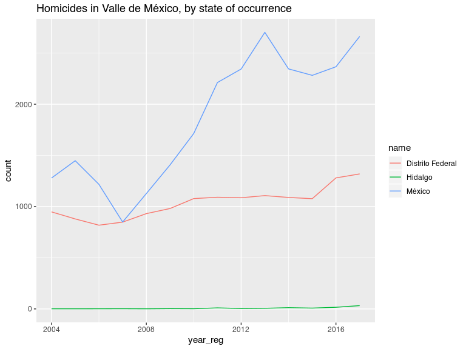

Injury Intent Deaths 2004-2017 in Mexico
================
Diego Valle-Jones
February 28, 2019

-   [Injury Intent Deaths 2004-2017 in Mexico](#injury-intent-deaths-2004-2017-in-mexico)
    -   [What does it do?](#what-does-it-do)
    -   [Installation](#installation)
    -   [Examples](#examples)
    -   [Warning](#warning)
    -   [License](#license)

Injury Intent Deaths 2004-2017 in Mexico
========================================

[](https://travis-ci.org/diegovalle/mxmortalitydb)

|              |                                                 |
|--------------|-------------------------------------------------|
| **Author:**  | Diego Valle-Jones                               |
| **License:** | [MIT](http://en.wikipedia.org/wiki/MIT_License) |
| **Website:** | <https://github.com/diegovalle/mxmortalitydb>   |

What does it do?
----------------

This is a data only package containing all injury intent deaths (accidents, suicides, homicides, legal interventions, and deaths of unspecified intent) registered by the SSA/INEGI from 2004 to 2017. The data source for the database is the [INEGI](http://www.inegi.org.mx/est/contenidos/proyectos/registros/vitales/mortalidad/default.aspx). In addition the data was coded with the Injury Mortality Matrix provided by the [CDC](http://www.cdc.gov/nchs/data/ice/icd10_transcode.pdf). The code used to clean the database is available [as a separate program](https://github.com/diegovalle/death.index)

Installation
------------

For the moment this package is only available from github. For the development version:

``` r
if (!require(devtools)) {
    install.packages("devtools")
}
devtools::install_github('diegovalle/mxmortalitydb')
```

``` r
library(mxmortalitydb)
library(ggplot2)
suppressPackageStartupMessages(library(dplyr))
```

Examples
--------

Deaths by homicide in Mexico

``` r
injury.intent %>%
  filter(intent == "Homicide") %>%
  group_by(year_reg, intent) %>%
  summarise(count = n())
```

    ## # A tibble: 14 x 3
    ## # Groups:   year_reg [?]
    ##    year_reg intent   count
    ##       <int> <fct>    <int>
    ##  1     2004 Homicide  9330
    ##  2     2005 Homicide  9926
    ##  3     2006 Homicide 10454
    ##  4     2007 Homicide  8868
    ##  5     2008 Homicide 14007
    ##  6     2009 Homicide 19804
    ##  7     2010 Homicide 25757
    ##  8     2011 Homicide 27213
    ##  9     2012 Homicide 25967
    ## 10     2013 Homicide 23063
    ## 11     2014 Homicide 20013
    ## 12     2015 Homicide 20763
    ## 13     2016 Homicide 24560
    ## 14     2017 Homicide 32082

All deaths of unknown intent in Sinaloa (state code 25) where the injury mechanism was a firearm, by year of registration:

``` r
## The main data.frame in the package is called injury.intent
injury.intent %>%
  filter(is.na(intent)  & 
           mechanism == "Firearm" & 
           state_reg == 25 ) %>%
  group_by(year_reg, intent) %>%
  summarise(count = n())
```

    ## # A tibble: 12 x 3
    ## # Groups:   year_reg [?]
    ##    year_reg intent count
    ##       <int> <fct>  <int>
    ##  1     2004 <NA>      11
    ##  2     2005 <NA>      11
    ##  3     2006 <NA>       2
    ##  4     2009 <NA>       8
    ##  5     2010 <NA>       7
    ##  6     2011 <NA>      25
    ##  7     2012 <NA>     197
    ##  8     2013 <NA>       8
    ##  9     2014 <NA>       1
    ## 10     2015 <NA>       1
    ## 11     2016 <NA>       3
    ## 12     2017 <NA>       1

In addition to the injury.intent data.frame several other datasets are available:

-   **aggressor.relation.code** (relationship between the aggressor and his victim, useful for merging aggressor\_relationship\_code, Spanish)
-   **geo.codes** (names of states and municipios, useful for merging state\_reg, state\_occur\_death and mun\_reg, mun\_occur\_death codes)
-   **icd.103** (list of 103 deceases by the WHO, Spanish)
-   **metro.areas** (2010 metro areas as defined by the CONAPO along with 2010 population counts)
-   **big.municipios** (since metro areas are not statistical in nature this is a list of all municipios which are bigger than the smallest metro area but are not part of one)
-   **mex.list.group** (groups of deceases, Spanish)
-   **mex.list** (list of deceases, Spanish)

Homicides merged with the aggressor.relation.code table:

``` r
df <- injury.intent %>%
  filter(intent == "Homicide") %>%
  group_by(year_reg, aggressor_relation_code) %>%
  summarise(count = n())
## A couple of other tables are included in the package to
## interpret some of the values in injury.intent
merge(df, aggressor.relation.code)
```

    ##     aggressor_relation_code year_reg count            relationship
    ## 1                         1     2012    25                   Padre
    ## 2                         1     2015     7                   Padre
    ## 3                         1     2017     7                   Padre
    ## 4                         1     2016    13                   Padre
    ## 5                         1     2014   107                   Padre
    ## 6                         1     2013    18                   Padre
    ## 7                         2     2016     9                   Madre
    ## 8                         2     2014    16                   Madre
    ## 9                         2     2017     2                   Madre
    ## 10                        2     2013    17                   Madre
    ## 11                        2     2015    11                   Madre
    ## 12                        2     2012    64                   Madre
    ## 13                        3     2017    13                 Hermano
    ## 14                        3     2015     9                 Hermano
    ## 15                        3     2012    14                 Hermano
    ## 16                        3     2013    16                 Hermano
    ## 17                        3     2014    13                 Hermano
    ## 18                        3     2016    11                 Hermano
    ## 19                        4     2015     2                 Hermana
    ## 20                        4     2012     7                 Hermana
    ## 21                        4     2013     6                 Hermana
    ## 22                        4     2014     9                 Hermana
    ## 23                        4     2017     5                 Hermana
    ## 24                        4     2016     4                 Hermana
    ## 25                        5     2012    10                    Hijo
    ## 26                        5     2013    14                    Hijo
    ## 27                        5     2017     9                    Hijo
    ## 28                        5     2016    13                    Hijo
    ## 29                        5     2015    10                    Hijo
    ## 30                        5     2014    20                    Hijo
    ## 31                        6     2012     1                    Hija
    ## 32                        6     2016     3                    Hija
    ## 33                        6     2013     2                    Hija
    ## 34                        6     2015     1                    Hija
    ## 35                        6     2014     2                    Hija
    ## 36                        7     2016     1                  Abuelo
    ## 37                        7     2015     1                  Abuelo
    ## 38                        7     2014     2                  Abuelo
    ## 39                        7     2012     5                  Abuelo
    ## 40                        7     2013     4                  Abuelo
    ## 41                        8     2014     8                  Abuela
    ## 42                        8     2013     5                  Abuela
    ## 43                        8     2012     3                  Abuela
    ## 44                        8     2016     1                  Abuela
    ## 45                        9     2015     3                   Nieto
    ## 46                        9     2013    29                   Nieto
    ## 47                        9     2014    19                   Nieto
    ## 48                        9     2017     3                   Nieto
    ## 49                        9     2012     5                   Nieto
    ## 50                        9     2016     4                   Nieto
    ## 51                       10     2013     2                   Nieta
    ## 52                       10     2012     1                   Nieta
    ## 53                       10     2014     1                   Nieta
    ## 54                       11     2012    27         Esposo, Cónyuge
    ## 55                       11     2017     9         Esposo, Cónyuge
    ## 56                       11     2015    30         Esposo, Cónyuge
    ## 57                       11     2016    24         Esposo, Cónyuge
    ## 58                       11     2013    29         Esposo, Cónyuge
    ## 59                       11     2014    22         Esposo, Cónyuge
    ## 60                       12     2017     2         Esposa, Cónyuge
    ## 61                       12     2016     4         Esposa, Cónyuge
    ## 62                       12     2014    10         Esposa, Cónyuge
    ## 63                       12     2012     3         Esposa, Cónyuge
    ## 64                       12     2015     2         Esposa, Cónyuge
    ## 65                       12     2013     9         Esposa, Cónyuge
    ## 66                       13     2015     8                     Tío
    ## 67                       13     2013     9                     Tío
    ## 68                       13     2014     6                     Tío
    ## 69                       13     2012     7                     Tío
    ## 70                       13     2017     6                     Tío
    ## 71                       13     2016    13                     Tío
    ## 72                       14     2012     1                     Tía
    ## 73                       15     2012    19                 Sobrino
    ## 74                       15     2015     9                 Sobrino
    ## 75                       15     2013    14                 Sobrino
    ## 76                       15     2014    10                 Sobrino
    ## 77                       15     2017     9                 Sobrino
    ## 78                       15     2016     4                 Sobrino
    ## 79                       16     2016     1                 Sobrina
    ## 80                       17     2017    13                   Primo
    ## 81                       17     2013    15                   Primo
    ## 82                       17     2012    14                   Primo
    ## 83                       17     2014    10                   Primo
    ## 84                       17     2015    11                   Primo
    ## 85                       17     2016     9                   Primo
    ## 86                       18     2016     1                   Prima
    ## 87                       21     2012     1                Bisnieto
    ## 88                       27     2017     2                  Suegro
    ## 89                       27     2016     1                  Suegro
    ## 90                       27     2012     2                  Suegro
    ## 91                       27     2015     2                  Suegro
    ## 92                       27     2013     1                  Suegro
    ## 93                       31     2012     4                   Yerno
    ## 94                       31     2015     4                   Yerno
    ## 95                       31     2014     1                   Yerno
    ## 96                       31     2016     3                   Yerno
    ## 97                       31     2013     5                   Yerno
    ## 98                       31     2017     4                   Yerno
    ## 99                       33     2015     9                  Cuñado
    ## 100                      33     2013     8                  Cuñado
    ## 101                      33     2016     3                  Cuñado
    ## 102                      33     2014     9                  Cuñado
    ## 103                      33     2017     6                  Cuñado
    ## 104                      33     2012     9                  Cuñado
    ## 105                      34     2012     1                  Cuñada
    ## 106                      35     2014     2                 Concuño
    ## 107                      35     2012     1                 Concuño
    ## 108                      35     2013     1                 Concuño
    ## 109                      35     2017     2                 Concuño
    ## 110                      37     2014     2               Padrastro
    ## 111                      37     2013     7               Padrastro
    ## 112                      37     2012     6               Padrastro
    ## 113                      37     2015     6               Padrastro
    ## 114                      37     2016     6               Padrastro
    ## 115                      37     2017     2               Padrastro
    ## 116                      38     2013     1               Madrastra
    ## 117                      39     2014     1                Hijastro
    ## 118                      39     2012     2                Hijastro
    ## 119                      39     2015     2                Hijastro
    ## 120                      39     2017     1                Hijastro
    ## 121                      39     2016     1                Hijastro
    ## 122                      39     2013     2                Hijastro
    ## 123                      41     2013     3             Hermanastro
    ## 124                      41     2012     1             Hermanastro
    ## 125                      41     2014     1             Hermanastro
    ## 126                      45     2012     9    Concubino, compañero
    ## 127                      45     2016    25    Concubino, compañero
    ## 128                      45     2013    27    Concubino, compañero
    ## 129                      45     2017    21    Concubino, compañero
    ## 130                      45     2014    26    Concubino, compañero
    ## 131                      45     2015    28    Concubino, compañero
    ## 132                      46     2012     4    Concubina, compañera
    ## 133                      46     2016     6    Concubina, compañera
    ## 134                      46     2017     4    Concubina, compañera
    ## 135                      46     2014     7    Concubina, compañera
    ## 136                      46     2013     4    Concubina, compañera
    ## 137                      46     2015     5    Concubina, compañera
    ## 138                      47     2012     3 Amante, Amasio, Querido
    ## 139                      47     2016     2 Amante, Amasio, Querido
    ## 140                      47     2017     1 Amante, Amasio, Querido
    ## 141                      47     2015     1 Amante, Amasio, Querido
    ## 142                      47     2013     1 Amante, Amasio, Querido
    ## 143                      48     2014     1 Amante, Amasia, Querida
    ## 144                      49     2017     1                   Novio
    ## 145                      49     2012     2                   Novio
    ## 146                      49     2015     2                   Novio
    ## 147                      49     2014     2                   Novio
    ## 148                      49     2016     4                   Novio
    ## 149                      49     2013     3                   Novio
    ## 150                      51     2017     3               Ex esposo
    ## 151                      51     2014     5               Ex esposo
    ## 152                      51     2012     3               Ex esposo
    ## 153                      51     2016     4               Ex esposo
    ## 154                      51     2015     3               Ex esposo
    ## 155                      51     2013     2               Ex esposo
    ## 156                      52     2016     2               Ex esposa
    ## 157                      53     2015     1                 Padrino
    ## 158                      55     2014     1                 Ahijado
    ## 159                      57     2015     1                Compadre
    ## 160                      57     2012     1                Compadre
    ## 161                      57     2014     1                Compadre
    ## 162                      61     2013     1    Trabajador doméstico
    ## 163                      66     2015     6                Conocido
    ## 164                      66     2017    11                Conocido
    ## 165                      66     2012     5                Conocido
    ## 166                      66     2014     4                Conocido
    ## 167                      66     2013     6                Conocido
    ## 168                      66     2016    15                Conocido
    ## 169                      67     2012     5                  Vecino
    ## 170                      67     2015     5                  Vecino
    ## 171                      67     2017     8                  Vecino
    ## 172                      67     2013     3                  Vecino
    ## 173                      67     2016     5                  Vecino
    ## 174                      67     2014     4                  Vecino
    ## 175                      68     2014     1                   Amigo
    ## 176                      68     2012     6                   Amigo
    ## 177                      68     2016     5                   Amigo
    ## 178                      68     2015     2                   Amigo
    ## 179                      68     2017     3                   Amigo
    ## 180                      68     2013     4                   Amigo
    ## 181                      69     2013     1                   Amiga
    ## 182                      69     2012     1                   Amiga
    ## 183                      70     2014     7           Otro familiar
    ## 184                      70     2015     1           Otro familiar
    ## 185                      70     2017     1           Otro familiar
    ## 186                      70     2012     3           Otro familiar
    ## 187                      70     2016     3           Otro familiar
    ## 188                      71     2012     1          Sin parentesco
    ## 189                      71     2015    12          Sin parentesco
    ## 190                      71     2014     7          Sin parentesco
    ## 191                      71     2013     5          Sin parentesco
    ## 192                      71     2016    19          Sin parentesco
    ## 193                      71     2017    22          Sin parentesco
    ## 194                      72     2016   405                 Ninguno
    ## 195                      72     2013   358                 Ninguno
    ## 196                      72     2012   438                 Ninguno
    ## 197                      72     2014   324                 Ninguno
    ## 198                      72     2017   256                 Ninguno
    ## 199                      72     2015   339                 Ninguno
    ## 200                      88     2016     2               No aplica
    ## 201                      88     2015    25               No aplica
    ## 202                      88     2017     3               No aplica
    ## 203                      88     2014     3               No aplica
    ## 204                      99     2015 20205         No especificado
    ## 205                      99     2017 31653         No especificado
    ## 206                      99     2016 23934         No especificado
    ## 207                      99     2014 19349         No especificado
    ## 208                      99     2013 22431         No especificado
    ## 209                      99     2012 25253         No especificado

A plot of female homicide counts (making sure to exclude those that occurred outside Mexico):

``` r
## make sure to only count deaths that occurred inside Mexico (codes 33 to 35 are USA, LATAM and Other)
df <- injury.intent %>%
  filter(sex == "Female" & 
           intent == "Homicide" & 
           !state_occur_death %in% 33:35) %>%
  group_by(year_reg, intent) %>%
  summarise(count = n())
ggplot(df, aes(year_reg, count)) +
  geom_line() +
  labs(title = "Female homicides in Mexico, by year of registration")
```


Homicides in the Mexico City metro area (ZM Valle de México), by the state where the murder was *registered*

``` r
plotMetro <- function(metro.name) {
  require(stringr)
  ## data.frame metro.areas contains the 2010 CONAPO metro areas
  df <- merge(injury.intent, 
              metro.areas, 
              by.x = c('state_reg', 'mun_reg'), 
              by.y=c('state_code', 'mun_code'))
  ## Homicides in Mexico City, by state of registratio
  df2 <- df %>%
    filter(metro_area == metro.name & 
             intent == "Homicide") %>%
    group_by(state_reg, year_reg) %>%
    summarise(count = n())
  ## data.frame geo.codes contains the names of Mexican states (with mun_code 0) and municipios
  df2 <- merge(df2, subset(geo.codes, mun_code ==0), by.x = 'state_reg', by.y = 'state_code')
  ggplot(df2, aes(year_reg, count, group = state_reg, color = name)) +
    geom_line() +
    labs(title = str_c("Homicides in ", metro.name, ", by state of registration"))
  }
plotMetro("Valle de México")
```

    ## Loading required package: stringr


The drop in homicides in the State of Mexico looks weird, let's plot by where the murder *occurred*

``` r
plotMetro_occur <- function(metro.name) {
  require(stringr)
  ## data.frame metro.areas contains the 2010 CONAPO metro areas
  df <- merge(injury.intent, 
              metro.areas, 
              by.x = c('state_occur_death', 'mun_occur_death'), 
              by.y=c('state_code', 'mun_code'))
  ## Homicides in Mexico City, by state of registratio
  df2 <- df %>%
    filter(metro_area == metro.name & 
             intent == "Homicide") %>%
    group_by(state_occur_death, year_reg) %>%
    summarise(count = n())
  ## data.frame geo.codes contains the names of Mexican states (with mun_code 0) and municipios
  df2 <- merge(df2, subset(geo.codes, mun_code ==0), by.x = 'state_occur_death', by.y = 'state_code')
  ggplot(df2, aes(year_reg, count, group = state_occur_death, color = name)) +
    geom_line() +
    labs(title = str_c("Homicides in ", metro.name, ", by state of occurrence"))
  }
plotMetro_occur("Valle de México")
```



So something changed in the way homicides were registered in the State of Mexico and you have to make sure to plot by where the homicide occurred.

Warning
-------

I encourage you to get acquainted with the database since it may contain some errors (introduced at the source) and some fields may be difficult to interpret because of the large number of missing values (see the aggressor relation example). The field *intent.imputed* is the result of running a statistical model to impute the intent of deaths of unknown intent, and is mainly useful to the author of this package. Feel free to ignore the column.

Total Imputed Homicides in Mexico:

``` r
## make sure to only count deaths that occurred inside Mexico (codes 33 to 35 are USA, LATAM and Other)
injury.intent %>%
  filter(intent.imputed == "Homicide" & !state_occur_death %in% 33:35) %>%
  group_by(year_reg) %>%
  summarise(count = n())
```

    ## # A tibble: 14 x 2
    ##    year_reg count
    ##       <int> <int>
    ##  1     2004 10557
    ##  2     2005 11158
    ##  3     2006 11626
    ##  4     2007 10581
    ##  5     2008 15440
    ##  6     2009 21270
    ##  7     2010 27701
    ##  8     2011 30275
    ##  9     2012 28095
    ## 10     2013 25109
    ## 11     2014 22038
    ## 12     2015 22650
    ## 13     2016 26567
    ## 14     2017 34713

License
-------

This package is free and open source software, licensed [MIT](http://en.wikipedia.org/wiki/MIT_License).
