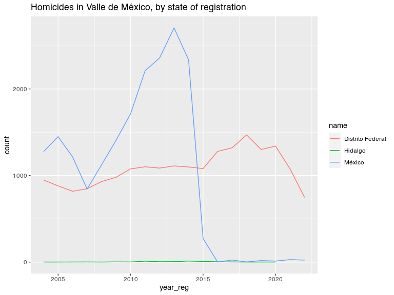
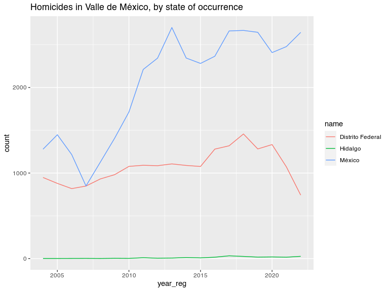

Injury Intent Deaths 2004-2018 in Mexico
================
Diego Valle-Jones
February 28, 2019

# Injury Intent Deaths 2004-2018 in Mexico

[](https://travis-ci.org/diegovalle/mxmortalitydb)

|              |                                                 |
| ------------ | ----------------------------------------------- |
| **Author:**  | Diego Valle-Jones                               |
| **License:** | [MIT](http://en.wikipedia.org/wiki/MIT_License) |
| **Website:** | <https://github.com/diegovalle/mxmortalitydb>   |

## What does it do?

This is a data only package containing all injury intent deaths
(accidents, suicides, homicides, legal interventions, and deaths of
unspecified intent) registered by the SSA/INEGI from 2004 to 2018. The
data source for the database is the
[INEGI](http://www.inegi.org.mx/est/contenidos/proyectos/registros/vitales/mortalidad/default.aspx).
In addition the data was coded with the Injury Mortality Matrix provided
by the [CDC](http://www.cdc.gov/nchs/data/ice/icd10_transcode.pdf). The
code used to clean the database is available [as a separate
program](https://github.com/diegovalle/death.index)

## Installation

For the moment this package is only available from github. For the
development version:

``` r
if (!require(devtools)) {
    install.packages("devtools")
}
devtools::install_github('diegovalle/mxmortalitydb')
```

``` r
library(mxmortalitydb)
library(ggplot2)
suppressPackageStartupMessages(library(dplyr))
```

## Examples

Deaths by homicide in Mexico

``` r
injury.intent %>%
  filter(intent == "Homicide") %>%
  group_by(year_reg, intent) %>%
  summarise(count = n())
```

    ## # A tibble: 15 x 3
    ## # Groups:   year_reg [15]
    ##    year_reg intent   count
    ##       <int> <fct>    <int>
    ##  1     2004 Homicide  9330
    ##  2     2005 Homicide  9926
    ##  3     2006 Homicide 10454
    ##  4     2007 Homicide  8868
    ##  5     2008 Homicide 14007
    ##  6     2009 Homicide 19804
    ##  7     2010 Homicide 25757
    ##  8     2011 Homicide 27213
    ##  9     2012 Homicide 25967
    ## 10     2013 Homicide 23063
    ## 11     2014 Homicide 20013
    ## 12     2015 Homicide 20763
    ## 13     2016 Homicide 24560
    ## 14     2017 Homicide 32082
    ## 15     2018 Homicide 36687

All deaths of unknown intent in Sinaloa (state code 25) where the injury
mechanism was a firearm, by year of registration:

``` r
## The main data.frame in the package is called injury.intent
injury.intent %>%
  filter(is.na(intent)  & 
           mechanism == "Firearm" & 
           state_reg == 25 ) %>%
  group_by(year_reg, intent) %>%
  summarise(count = n())
```

    ## Warning: Factor `intent` contains implicit NA, consider using
    ## `forcats::fct_explicit_na`

    ## # A tibble: 12 x 3
    ## # Groups:   year_reg [12]
    ##    year_reg intent count
    ##       <int> <fct>  <int>
    ##  1     2004 <NA>      11
    ##  2     2005 <NA>      11
    ##  3     2006 <NA>       2
    ##  4     2009 <NA>       8
    ##  5     2010 <NA>       7
    ##  6     2011 <NA>      25
    ##  7     2012 <NA>     197
    ##  8     2013 <NA>       8
    ##  9     2014 <NA>       1
    ## 10     2015 <NA>       1
    ## 11     2016 <NA>       3
    ## 12     2017 <NA>       1

In addition to the injury.intent data.frame several other datasets are
available:

  - **aggressor.relation.code** (relationship between the aggressor and
    his victim, useful for merging aggressor\_relationship\_code,
    Spanish)
  - **geo.codes** (names of states and municipios, useful for merging
    state\_reg, state\_occur\_death and mun\_reg, mun\_occur\_death
    codes)
  - **icd.103** (list of 103 deceases by the WHO, Spanish)
  - **metro.areas** (2010 metro areas as defined by the CONAPO along
    with 2010 population counts)
  - **big.municipios** (since metro areas are not statistical in nature
    this is a list of all municipios which are bigger than the smallest
    metro area but are not part of one)
  - **mex.list.group** (groups of deceases, Spanish)
  - **mex.list** (list of deceases, Spanish)

Homicides merged with the aggressor.relation.code table:

``` r
df <- injury.intent %>%
  filter(intent == "Homicide") %>%
  group_by(year_reg, aggressor_relation_code) %>%
  summarise(count = n())
## A couple of other tables are included in the package to
## interpret some of the values in injury.intent
merge(df, aggressor.relation.code)
```

    ##     aggressor_relation_code year_reg count            relationship
    ## 1                         1     2012    25                   Padre
    ## 2                         1     2015     7                   Padre
    ## 3                         1     2017     7                   Padre
    ## 4                         1     2016    13                   Padre
    ## 5                         1     2018     6                   Padre
    ## 6                         1     2014   107                   Padre
    ## 7                         1     2013    18                   Padre
    ## 8                         2     2016     9                   Madre
    ## 9                         2     2017     2                   Madre
    ## 10                        2     2018     8                   Madre
    ## 11                        2     2015    11                   Madre
    ## 12                        2     2012    64                   Madre
    ## 13                        2     2013    17                   Madre
    ## 14                        2     2014    16                   Madre
    ## 15                        3     2017    13                 Hermano
    ## 16                        3     2015     9                 Hermano
    ## 17                        3     2018    14                 Hermano
    ## 18                        3     2014    13                 Hermano
    ## 19                        3     2012    14                 Hermano
    ## 20                        3     2013    16                 Hermano
    ## 21                        3     2016    11                 Hermano
    ## 22                        4     2013     6                 Hermana
    ## 23                        4     2015     2                 Hermana
    ## 24                        4     2012     7                 Hermana
    ## 25                        4     2018     4                 Hermana
    ## 26                        4     2014     9                 Hermana
    ## 27                        4     2016     4                 Hermana
    ## 28                        4     2017     5                 Hermana
    ## 29                        5     2012    10                    Hijo
    ## 30                        5     2016    13                    Hijo
    ## 31                        5     2013    14                    Hijo
    ## 32                        5     2017     9                    Hijo
    ## 33                        5     2015    10                    Hijo
    ## 34                        5     2018    11                    Hijo
    ## 35                        5     2014    20                    Hijo
    ## 36                        6     2012     1                    Hija
    ## 37                        6     2015     1                    Hija
    ## 38                        6     2016     3                    Hija
    ## 39                        6     2013     2                    Hija
    ## 40                        6     2014     2                    Hija
    ## 41                        6     2018     2                    Hija
    ## 42                        7     2016     1                  Abuelo
    ## 43                        7     2012     5                  Abuelo
    ## 44                        7     2014     2                  Abuelo
    ## 45                        7     2015     1                  Abuelo
    ## 46                        7     2013     4                  Abuelo
    ## 47                        8     2013     5                  Abuela
    ## 48                        8     2014     8                  Abuela
    ## 49                        8     2016     1                  Abuela
    ## 50                        8     2012     3                  Abuela
    ## 51                        9     2014    19                   Nieto
    ## 52                        9     2015     3                   Nieto
    ## 53                        9     2013    29                   Nieto
    ## 54                        9     2017     3                   Nieto
    ## 55                        9     2012     5                   Nieto
    ## 56                        9     2016     4                   Nieto
    ## 57                        9     2018     1                   Nieto
    ## 58                       10     2013     2                   Nieta
    ## 59                       10     2014     1                   Nieta
    ## 60                       10     2012     1                   Nieta
    ## 61                       11     2017     9         Esposo, Cónyuge
    ## 62                       11     2016    24         Esposo, Cónyuge
    ## 63                       11     2018    15         Esposo, Cónyuge
    ## 64                       11     2014    22         Esposo, Cónyuge
    ## 65                       11     2012    27         Esposo, Cónyuge
    ## 66                       11     2013    29         Esposo, Cónyuge
    ## 67                       11     2015    30         Esposo, Cónyuge
    ## 68                       12     2016     4         Esposa, Cónyuge
    ## 69                       12     2014    10         Esposa, Cónyuge
    ## 70                       12     2017     2         Esposa, Cónyuge
    ## 71                       12     2012     3         Esposa, Cónyuge
    ## 72                       12     2013     9         Esposa, Cónyuge
    ## 73                       12     2018     5         Esposa, Cónyuge
    ## 74                       12     2015     2         Esposa, Cónyuge
    ## 75                       13     2018     2                     Tío
    ## 76                       13     2014     6                     Tío
    ## 77                       13     2013     9                     Tío
    ## 78                       13     2015     8                     Tío
    ## 79                       13     2012     7                     Tío
    ## 80                       13     2017     6                     Tío
    ## 81                       13     2016    13                     Tío
    ## 82                       14     2012     1                     Tía
    ## 83                       14     2018     1                     Tía
    ## 84                       15     2015     9                 Sobrino
    ## 85                       15     2014    10                 Sobrino
    ## 86                       15     2013    14                 Sobrino
    ## 87                       15     2018     4                 Sobrino
    ## 88                       15     2016     4                 Sobrino
    ## 89                       15     2017     9                 Sobrino
    ## 90                       15     2012    19                 Sobrino
    ## 91                       16     2016     1                 Sobrina
    ## 92                       17     2015    11                   Primo
    ## 93                       17     2017    13                   Primo
    ## 94                       17     2018    10                   Primo
    ## 95                       17     2014    10                   Primo
    ## 96                       17     2012    14                   Primo
    ## 97                       17     2016     9                   Primo
    ## 98                       17     2013    15                   Primo
    ## 99                       18     2016     1                   Prima
    ## 100                      21     2012     1                Bisnieto
    ## 101                      27     2018     3                  Suegro
    ## 102                      27     2012     2                  Suegro
    ## 103                      27     2017     2                  Suegro
    ## 104                      27     2015     2                  Suegro
    ## 105                      27     2013     1                  Suegro
    ## 106                      27     2016     1                  Suegro
    ## 107                      31     2012     4                   Yerno
    ## 108                      31     2016     3                   Yerno
    ## 109                      31     2018     3                   Yerno
    ## 110                      31     2015     4                   Yerno
    ## 111                      31     2014     1                   Yerno
    ## 112                      31     2013     5                   Yerno
    ## 113                      31     2017     4                   Yerno
    ## 114                      32     2018     1                   Nuera
    ## 115                      33     2016     3                  Cuñado
    ## 116                      33     2015     9                  Cuñado
    ## 117                      33     2017     6                  Cuñado
    ## 118                      33     2018     7                  Cuñado
    ## 119                      33     2014     9                  Cuñado
    ## 120                      33     2012     9                  Cuñado
    ## 121                      33     2013     8                  Cuñado
    ## 122                      34     2012     1                  Cuñada
    ## 123                      35     2014     2                 Concuño
    ## 124                      35     2012     1                 Concuño
    ## 125                      35     2017     2                 Concuño
    ## 126                      35     2013     1                 Concuño
    ## 127                      37     2014     2               Padrastro
    ## 128                      37     2013     7               Padrastro
    ## 129                      37     2016     6               Padrastro
    ## 130                      37     2017     2               Padrastro
    ## 131                      37     2012     6               Padrastro
    ## 132                      37     2018     2               Padrastro
    ## 133                      37     2015     6               Padrastro
    ## 134                      38     2013     1               Madrastra
    ## 135                      39     2012     2                Hijastro
    ## 136                      39     2014     1                Hijastro
    ## 137                      39     2015     2                Hijastro
    ## 138                      39     2016     1                Hijastro
    ## 139                      39     2013     2                Hijastro
    ## 140                      39     2017     1                Hijastro
    ## 141                      41     2012     1             Hermanastro
    ## 142                      41     2014     1             Hermanastro
    ## 143                      41     2018     1             Hermanastro
    ## 144                      41     2013     3             Hermanastro
    ## 145                      45     2016    25    Concubino, compañero
    ## 146                      45     2014    26    Concubino, compañero
    ## 147                      45     2017    21    Concubino, compañero
    ## 148                      45     2015    28    Concubino, compañero
    ## 149                      45     2012     9    Concubino, compañero
    ## 150                      45     2018    10    Concubino, compañero
    ## 151                      45     2013    27    Concubino, compañero
    ## 152                      46     2015     5    Concubina, compañera
    ## 153                      46     2012     4    Concubina, compañera
    ## 154                      46     2017     4    Concubina, compañera
    ## 155                      46     2016     6    Concubina, compañera
    ## 156                      46     2014     7    Concubina, compañera
    ## 157                      46     2013     4    Concubina, compañera
    ## 158                      47     2012     3 Amante, Amasio, Querido
    ## 159                      47     2016     2 Amante, Amasio, Querido
    ## 160                      47     2015     1 Amante, Amasio, Querido
    ## 161                      47     2013     1 Amante, Amasio, Querido
    ## 162                      47     2017     1 Amante, Amasio, Querido
    ## 163                      48     2014     1 Amante, Amasia, Querida
    ## 164                      49     2012     2                   Novio
    ## 165                      49     2017     1                   Novio
    ## 166                      49     2014     2                   Novio
    ## 167                      49     2013     3                   Novio
    ## 168                      49     2016     4                   Novio
    ## 169                      49     2015     2                   Novio
    ## 170                      50     2018     1                   Novia
    ## 171                      51     2016     4               Ex esposo
    ## 172                      51     2014     5               Ex esposo
    ## 173                      51     2018     6               Ex esposo
    ## 174                      51     2017     3               Ex esposo
    ## 175                      51     2012     3               Ex esposo
    ## 176                      51     2013     2               Ex esposo
    ## 177                      51     2015     3               Ex esposo
    ## 178                      52     2016     2               Ex esposa
    ## 179                      53     2015     1                 Padrino
    ## 180                      55     2014     1                 Ahijado
    ## 181                      57     2012     1                Compadre
    ## 182                      57     2015     1                Compadre
    ## 183                      57     2014     1                Compadre
    ## 184                      61     2013     1    Trabajador doméstico
    ## 185                      66     2012     5                Conocido
    ## 186                      66     2015     6                Conocido
    ## 187                      66     2013     6                Conocido
    ## 188                      66     2017    11                Conocido
    ## 189                      66     2018     7                Conocido
    ## 190                      66     2014     4                Conocido
    ## 191                      66     2016    15                Conocido
    ## 192                      67     2015     5                  Vecino
    ## 193                      67     2017     8                  Vecino
    ## 194                      67     2016     5                  Vecino
    ## 195                      67     2014     4                  Vecino
    ## 196                      67     2013     3                  Vecino
    ## 197                      67     2018     5                  Vecino
    ## 198                      67     2012     5                  Vecino
    ## 199                      68     2012     6                   Amigo
    ## 200                      68     2018     3                   Amigo
    ## 201                      68     2015     2                   Amigo
    ## 202                      68     2016     5                   Amigo
    ## 203                      68     2014     1                   Amigo
    ## 204                      68     2013     4                   Amigo
    ## 205                      68     2017     3                   Amigo
    ## 206                      69     2012     1                   Amiga
    ## 207                      69     2013     1                   Amiga
    ## 208                      70     2018    10           Otro familiar
    ## 209                      70     2017     1           Otro familiar
    ## 210                      70     2016     3           Otro familiar
    ## 211                      70     2015     1           Otro familiar
    ## 212                      70     2012     3           Otro familiar
    ## 213                      70     2014     7           Otro familiar
    ## 214                      71     2015    12          Sin parentesco
    ## 215                      71     2016    19          Sin parentesco
    ## 216                      71     2012     1          Sin parentesco
    ## 217                      71     2013     5          Sin parentesco
    ## 218                      71     2018    14          Sin parentesco
    ## 219                      71     2017    22          Sin parentesco
    ## 220                      71     2014     7          Sin parentesco
    ## 221                      72     2015   339                 Ninguno
    ## 222                      72     2016   405                 Ninguno
    ## 223                      72     2014   324                 Ninguno
    ## 224                      72     2013   358                 Ninguno
    ## 225                      72     2018   111                 Ninguno
    ## 226                      72     2017   256                 Ninguno
    ## 227                      72     2012   438                 Ninguno
    ## 228                      88     2018     2               No aplica
    ## 229                      88     2014     3               No aplica
    ## 230                      88     2017     3               No aplica
    ## 231                      88     2015    25               No aplica
    ## 232                      88     2016     2               No aplica
    ## 233                      99     2016 23934         No especificado
    ## 234                      99     2014 19349         No especificado
    ## 235                      99     2012 25253         No especificado
    ## 236                      99     2017 31653         No especificado
    ## 237                      99     2013 22431         No especificado
    ## 238                      99     2015 20205         No especificado
    ## 239                      99     2018 36418         No especificado

A plot of female homicide counts (making sure to exclude those that
occurred outside
Mexico):

``` r
## make sure to only count deaths that occurred inside Mexico (codes 33 to 35 are USA, LATAM and Other)
df <- injury.intent %>%
  filter(sex == "Female" & 
           intent == "Homicide" & 
           !state_occur_death %in% 33:35) %>%
  group_by(year_reg, intent) %>%
  summarise(count = n())
ggplot(df, aes(year_reg, count)) +
  geom_line() +
  labs(title = "Female homicides in Mexico, by year of registration")
```

<!-- -->

Homicides in the Mexico City metro area (ZM Valle de México), by the
state where the murder was *registered*

``` r
plotMetro <- function(metro.name) {
  require(stringr)
  ## data.frame metro.areas contains the 2010 CONAPO metro areas
  df <- merge(injury.intent, 
              metro.areas, 
              by.x = c('state_reg', 'mun_reg'), 
              by.y=c('state_code', 'mun_code'))
  ## Homicides in Mexico City, by state of registratio
  df2 <- df %>%
    filter(metro_area == metro.name & 
             intent == "Homicide") %>%
    group_by(state_reg, year_reg) %>%
    summarise(count = n())
  ## data.frame geo.codes contains the names of Mexican states (with mun_code 0) and municipios
  df2 <- merge(df2, subset(geo.codes, mun_code ==0), by.x = 'state_reg', by.y = 'state_code')
  ggplot(df2, aes(year_reg, count, group = state_reg, color = name)) +
    geom_line() +
    labs(title = str_c("Homicides in ", metro.name, ", by state of registration"))
  }
plotMetro("Valle de México")
```

    ## Loading required package: stringr

<!-- -->

The drop in homicides in the State of Mexico looks weird, let’s plot by
where the murder *occurred*

``` r
plotMetro_occur <- function(metro.name) {
  require(stringr)
  ## data.frame metro.areas contains the 2010 CONAPO metro areas
  df <- merge(injury.intent, 
              metro.areas, 
              by.x = c('state_occur_death', 'mun_occur_death'), 
              by.y=c('state_code', 'mun_code'))
  ## Homicides in Mexico City, by state of registratio
  df2 <- df %>%
    filter(metro_area == metro.name & 
             intent == "Homicide") %>%
    group_by(state_occur_death, year_reg) %>%
    summarise(count = n())
  ## data.frame geo.codes contains the names of Mexican states (with mun_code 0) and municipios
  df2 <- merge(df2, subset(geo.codes, mun_code ==0), by.x = 'state_occur_death', by.y = 'state_code')
  ggplot(df2, aes(year_reg, count, group = state_occur_death, color = name)) +
    geom_line() +
    labs(title = str_c("Homicides in ", metro.name, ", by state of occurrence"))
  }
plotMetro_occur("Valle de México")
```

<!-- -->

So something changed in the way homicides were registered in the State
of Mexico and you have to make sure to plot by where the homicide
occurred.

## Warning

I encourage you to get acquainted with the database since it may contain
some errors (introduced at the source) and some fields may be difficult
to interpret because of the large number of missing values (see the
aggressor relation example). The field *intent.imputed* is the result of
running a statistical model to impute the intent of deaths of unknown
intent, and is mainly useful to the author of this package. Feel free to
ignore the column.

Total Imputed Homicides in
Mexico:

``` r
## make sure to only count deaths that occurred inside Mexico (codes 33 to 35 are USA, LATAM and Other)
injury.intent %>%
  filter(intent.imputed == "Homicide" & !state_occur_death %in% 33:35) %>%
  group_by(year_reg) %>%
  summarise(count = n())
```

    ## # A tibble: 15 x 2
    ##    year_reg count
    ##       <int> <int>
    ##  1     2004 10608
    ##  2     2005 11184
    ##  3     2006 11668
    ##  4     2007 10590
    ##  5     2008 15445
    ##  6     2009 21297
    ##  7     2010 27713
    ##  8     2011 30301
    ##  9     2012 28129
    ## 10     2013 25159
    ## 11     2014 22111
    ## 12     2015 22707
    ## 13     2016 26606
    ## 14     2017 34763
    ## 15     2018 39475

## License

This package is free and open source software, licensed
[MIT](http://en.wikipedia.org/wiki/MIT_License).
